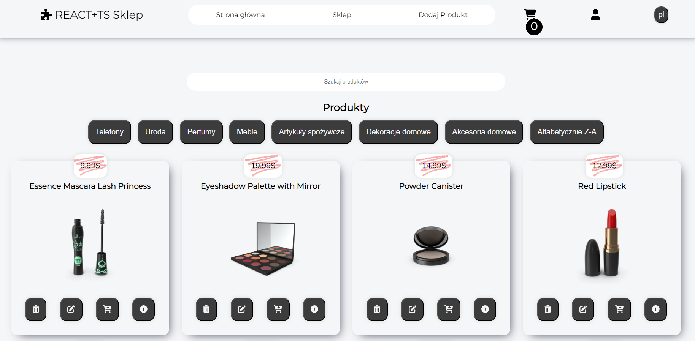

# REACT+TS Shop

Links [https://kunegunda-react-ts-shop.vercel.app](https://kunegunda-react-ts-shop.vercel.app)

## Project Description
An e-commerce application that allows adding, removing, and editing products. It uses the API from [dummy.json](https://dummyjson.com/) to fetch product information. Users can add products to the cart and manage them. The project utilizes reusable components such as modals, buttons, and inputs.

## Features
- Browse products by category
- Add products to the cart
- Manage products in the cart
- Add, remove, and edit products
- Use of reusable components like modal, button, and input

## Technologies
- React
- Redux
- TypeScript
- Module SCSS
- BEM Methodology
- i18Next
- Unit Testing

## Installation
1. Clone the repository:
   ```bash
   git clone https://github.com/KunegundaKosek/Shop.git
   cd shop
2. Install dependencies:
    ```bash
    npm install

## Running the Application
To start the application, run:
    ```bash
    npm start

This will run the app in development mode. Open [http://localhost:3000](http://localhost:3000) to view it in the browser.

## Running Tests
To run the unit tests, use:
    ```bash
    npm run test

## Project Structure
- assets: Contains fonts, translations, styles (mixins and SCSS variables), and images.
- components: Contains reusable components like buttons, modals, and inputs.
- context: Contains context providers for global state management.
- pages: Contains the main pages of the application along with their logic and styles.
- redux: Contains Redux-related files such as actions, reducers, and store configuration.

## Author
Kunegunda Kosek

Feel free to adjust the placeholder URL in the `git clone` command with the actual URL of your repository. Additionally, you can expand on the `features` or `technologies` sections if there are more specific details you would like to include.

## Images
1. Home Page: The home page features a navigation bar, a welcome message, and buttons encouraging users to start shopping or log in (login functionality is not yet added).


2. Products Page: The products page allows users to select categories and sort products alphabetically from Z to A. Users can edit a product, add it to the cart, delete it, or view more details.



3. Cart Icon: When a product is added to the cart, the number of items in the cart is displayed on the cart icon. There is also an option to change the language on the right side of the navigation bar.


4. Button Text Change: When the button is pressed, the text on the button changes accordingly, in this case to English.


5. Home Page Welcome: The home page offers a warm welcome and encourages users to shop. There are also buttons for redirecting to the product list and login page.


6. Add Product Form: A form for adding new products.


7. Single Product Tile: Each product tile allows for deleting, editing, adding to the cart, and viewing details.


8. Product Details: When viewing product details, users can see the description, category, and brand.


9. Product List: Here is the product list view.


10. Product Search: There is a product search feature available, along with sorting by category.


11. Search Results: The following image shows the search results.


12. No Products Found: If no product is found, a message will be displayed.


13. Mobile Version: The site is also optimized for mobile devices. The mobile version features a hamburger menu for easy navigation.


## Future Development Plans
- Login with Firebase: Integrate Firebase for user authentication.
- Increased Unit and E2E Testing: Implement more comprehensive unit tests and end-to-end (E2E) tests.
- Improved Mobile Version: Enhance the mobile version for a better user experience.
- Enhance Product Addition: Improve the process of adding new products.
- Advanced Filtering: Add more filtering options and update the filtering UI.
- Pagination: Reintroduce pagination (initially included but removed due to technical issues with product deletion).
- Animations with GSAP: Use the GSAP library to add animations.
- User Notifications: Display notifications using the react-toastify library for user interactions.
- Dark Mode: Implement a dark mode for the application.
- Form Validation with Formik: Use the Formik library for form validation.
